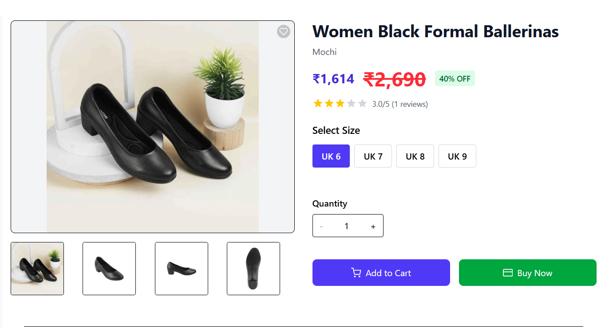

# React + Vite

# 🛒 LuckyFootwear – E-Commerce Platform

A full-stack **e-commerce web application** built using the **MERN stack** with modern UI design powered by **Tailwind CSS**.  
This project includes core e-commerce features like product catalog, search/filter, cart, checkout, authentication, order management, and an **admin dashboard** for business operations.

---

## Tech Stack

- **Frontend:** React.js, Tailwind CSS  
- **Backend:** Node.js, Express.js  
- **Database:** MongoDB  
- **Authentication:** JWT (JSON Web Tokens)  

---

##  Features

### User Features

- Browse **product catalog** with search and advanced filtering.  
- **Wishlist** for every user.  
- View **detailed product pages** with images, description, price, reviews, and related products.  
- **Shopping cart** linked to unique user IDs.  
- **Secure checkout** with JWT-based authentication.  
- **PDF invoice generation** after purchase.  
- **Address management** – save multiple addresses and select during checkout.  
- **Product reviews with images** after purchase.  
- **Return request** functionality for purchased items.  

###  Admin Features

- **Dashboard** to monitor:  
  - Total orders, deliveries, returns, and shipping status.  
  - User orders and cart details.  
- Manage products: **add, disable, or update products** (e.g., handle out-of-stock).  
- Reply to customer reviews.  
- Configure **offers and promotions**.

## Screenshots

###  Admin Dashboard  

### Home Page  
  
 

### Product Page  
 
  
 

### Cart Page  

### Checkout Page  
  
 
 

### Order Page  

